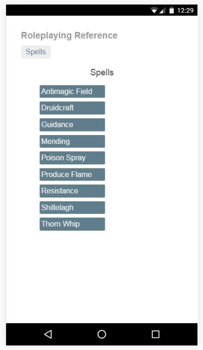

+++
title = "Progressive Web Application - Roleplayer's Reference"
template = "page.html"
date = 2016-07-14 # date of the post, not the 
year = 2016
[taxonomies]
tags = ["pwa", "progressive web application"]
+++

This web application is done with “mobile first” as the primary consideration.  After listening and
reading to the discussion at the Chrome developers Progressive Web App summit, I am sold on how big the mobile market
is.  And is growing.  Many times, the first I see of a website is on mobile, if it isn’t fast, or there are page
blocking advertisements, I leave it, close the tab or window and move on to something else.  It isn’t an attention span
issue, it is more “I want the content I clicked, and you’re not giving it to me”.

I digress.

This application is done with with Angular2 and Typescript, it uses Service Workers (Android only!!!, not
supported yet in the Safari browser) to store content for offline use, and for caching on return to the site.  After
visiting the site a couple times with a significant time space between visits, there should be a prompt to add to
homescreen.  Alternatively, on the first visit, a user could go to the browser menu (where bookmarks can be found), and
manually “add to homescreen”.

A cool convergence of a web application and native application. Visit the Roleplayers’ Reference app hosted on Firebase.

<a href="https://rp-ref.firebaseapp.com/" target="_blank">https://rp-ref.firebaseapp.com/</a>

